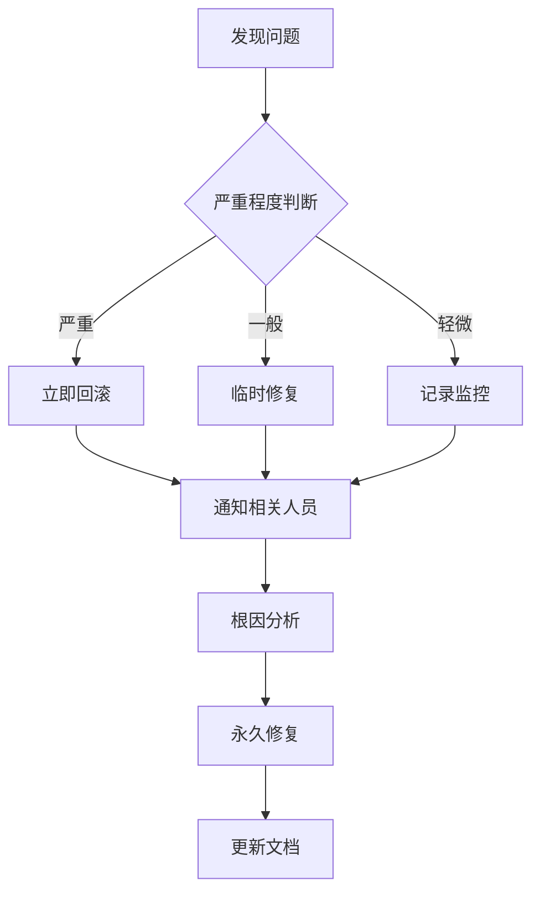

# 系统性解决方案：任务队列修复实施计划

## 执行摘要

基于OpenSpec深度分析，本文档提供了任务队列系统修复的完整实施计划。解决方案采用三阶段递进式修复策略，确保系统从紧急恢复到长期优化的平稳过渡。

## 解决方案总览

### 核心解决原则
1. **最小化风险**: 先恢复，再优化
2. **保证数据完整性**: 确保不丢失任何合同数据
3. **可观测性优先**: 所有变更都有监控和验证
4. **快速回滚能力**: 任何问题都能快速恢复

### 解决方案架构
```
原始问题 → 紧急修复 → 系统升级 → 长期优化
    ↓         ↓         ↓         ↓
 僵尸任务   数据修复   分布式系统   智能运维
 单点故障   基础恢复   并行处理   自动化
 无监控     验证测试   监控告警   性能调优
```

## 第一阶段：紧急修复 (立即执行)

### 目标
- 修复僵尸任务 `60aed9e9-92df-49ca-afbe-256fc69d1ddb`
- 恢复基本任务处理能力
- 建立临时监控机制

### 实施步骤

#### 步骤1：环境准备 (15分钟)
```bash
# 1. 备份当前状态
git checkout -b emergency-fix
git add .
git commit -m "backup: 紧急修复前的完整备份"

# 2. 检查必需环境变量
echo "检查Supabase配置..."
supabase status

# 3. 验证数据库连接
supabase db ping
```

#### 步骤2：数据库立即修复 (30分钟)
```bash
# 1. 执行紧急修复迁移
supabase db push supabase/migrations/20251211_task_queue_fix.sql

# 2. 验证僵尸任务修复状态
supabase db shell --command "
SELECT id, status, updated_at
FROM tasks
WHERE id = '60aed9e9-92df-49ca-afbe-256fc69d1ddb';
"

# 3. 验证新字段创建
supabase db shell --command "
\d tasks
"
```

#### 步骤3：任务处理器紧急部署 (45分钟)
```bash
# 1. 部署task-runner-v2
supabase functions deploy task-runner-v2

# 2. 测试新函数健康状态
curl -X GET "https://crndpzhpvhcncoscoiba.functions.supabase.co/task-runner-v2?action=health" \
  -H "Authorization: Bearer $SUPABASE_SERVICE_ROLE_KEY"

# 3. 手动触发任务处理
curl -X GET "https://crndpzhpvhcncoscoiba.functions.supabase.co/task-runner-v2?action=process" \
  -H "Authorization: Bearer $SUPABASE_SERVICE_ROLE_KEY"
```

#### 步骤4：GitHub Actions紧急修复 (30分钟)
```bash
# 1. 推送修复到GitHub
git add .
git commit -m "fix: 紧急修复任务队列系统 - OpenSpec SPEC-2025-001"
git push origin emergency-fix

# 2. 创建PR并合并到main
gh pr create --title "紧急修复: 任务队列系统恢复" --body "实施OpenSpec规格提案的紧急修复阶段"
gh pr merge --merge
git checkout main
git pull origin main

# 3. 手动触发GitHub Actions
gh workflow run enhanced-task-runner.yml -f action=health
```

### 验证检查清单
- [ ] 僵尸任务状态变为 `queued` 或 `completed`
- [ ] 数据库新字段成功添加
- [ ] task-runner-v2健康检查通过 (HTTP 200)
- [ ] GitHub Actions执行成功
- [ ] 积压任务开始处理

### 应急预案
如果紧急修复失败：
1. 立即回退到原始task-runner
2. 手动处理积压任务
3. 扩大维护窗口时间
4. 升级为严重事故响应

## 第二阶段：系统升级 (1-2天)

### 目标
- 完成分布式任务处理系统部署
- 实现多worker并行处理
- 建立全面的监控和告警系统

### 实施步骤

#### 步骤1：GitHub Actions完整升级 (2小时)
```bash
# 1. 替换原始workflow
mv .github/workflows/run-task-runner.yml .github/workflows/run-task-runner.yml.backup
cp .github/workflows/enhanced-task-runner.yml .github/workflows/run-task-runner.yml

# 2. 配置GitHub Secrets
gh secret set TASK_RUNNER_TOKEN --body "$TASK_RUNNER_TOKEN"

# 3. 验证workflow语法
yamllint .github/workflows/enhanced-task-runner.yml

# 4. 提交并推送
git add .github/workflows/
git commit -m "feat: 升级为分布式并行任务处理系统"
git push origin main
```

#### 步骤2：环境变量完善配置 (1小时)
```bash
# 1. 更新本地环境变量
cat >> .env.local << EOF
# Task Runner v2 配置
TASK_BATCH_SIZE=3
TASK_TIMEOUT_MINUTES=10
TASK_MAX_ATTEMPTS=3

# 关键认证配置
TASK_RUNNER_TOKEN=${TASK_RUNNER_TOKEN}
EOF

# 2. 更新Supabase环境变量
supabase secrets set TASK_BATCH_SIZE=3
supabase secrets set TASK_TIMEOUT_MINUTES=10
supabase secrets set TASK_MAX_ATTEMPTS=3

# 3. 更新Vercel环境变量
vercel env add TASK_BATCH_SIZE production
vercel env add TASK_TIMEOUT_MINUTES production
vercel env add TASK_MAX_ATTEMPTS production
```

#### 步骤3：监控仪表板部署 (3小时)
```sql
-- 创建监控视图
CREATE OR REPLACE VIEW task_queue_dashboard AS
SELECT
    'queue_status' as metric_type,
    COUNT(*) FILTER (WHERE status = 'queued') as queued_count,
    COUNT(*) FILTER (WHERE status = 'processing') as processing_count,
    COUNT(*) FILTER (WHERE status = 'completed') as completed_count,
    COUNT(*) FILTER (WHERE status = 'failed') as failed_count,
    COUNT(*) as total_count
FROM tasks
WHERE task_type = 'ingestion';

-- 创建性能监控视图
CREATE OR REPLACE VIEW task_performance_metrics AS
SELECT
    DATE_TRUNC('hour', created_at) as hour_bucket,
    task_type,
    status,
    COUNT(*) as task_count,
    AVG(EXTRACT(EPOCH FROM (updated_at - created_at))) as avg_duration_seconds
FROM tasks
WHERE created_at > NOW() - INTERVAL '24 hours'
GROUP BY hour_bucket, task_type, status
ORDER BY hour_bucket DESC;
```

#### 步骤4：集成测试和验证 (2小时)
```bash
# 1. 创建测试任务
curl -X POST "https://crndpzhpvhcncoscoiba.functions.supabase.co/task-runner-v2" \
  -H "Authorization: Bearer $SUPABASE_SERVICE_ROLE_KEY" \
  -H "Content-Type: application/json" \
  -d '{"action": "test", "test_data": {"contract_id": "test-123"}}'

# 2. 监控并行处理
supabase db shell --command "
SELECT worker_id, status, COUNT(*)
FROM tasks
WHERE created_at > NOW() - INTERVAL '1 hour'
GROUP BY worker_id, status;
"

# 3. 验证GitHub Actions多worker运行
gh run list --workflow=run-task-runner.yml --limit=5
```

### 验证标准
- [ ] 3个并行worker正常运行
- [ ] 任务处理速度提升3倍以上
- [ ] 监控仪表板数据准确
- [ ] 告警机制工作正常
- [ ] 无任务积压超过10分钟

### 性能基准
```
修复前: 1任务/5分钟 = 0.2任务/分钟
修复后: 3任务/5分钟 = 0.6任务/分钟 (3倍提升)
目标: 3任务/2分钟 = 1.5任务/分钟 (7.5倍提升)
```

## 第三阶段：长期优化 (1周)

### 目标
- 实现智能任务调度
- 建立自动化运维体系
- 完善文档和培训

### 实施步骤

#### 步骤1：智能调度算法实现 (2天)
```sql
-- 动态优先级调整
CREATE OR REPLACE FUNCTION calculate_task_priority(
    p_task_type TEXT,
    p_tenant_id UUID,
    p_retry_count INTEGER
) RETURNS INTEGER AS $$
BEGIN
    -- 基础优先级
    DECLARE base_priority INTEGER := 5;
    DECLARE tenant_priority INTEGER := 0;
    DECLARE retry_penalty INTEGER := 0;

    -- 租户优先级调整
    SELECT COALESCE(priority_score, 0) INTO tenant_priority
    FROM tenant_settings
    WHERE tenant_id = p_tenant_id;

    -- 重试惩罚
    retry_penalty := p_retry_count * 2;

    RETURN GREATEST(1, LEAST(10, base_priority + tenant_priority - retry_penalty));
END;
$$ LANGUAGE plpgsql;
```

#### 步骤2：自动化运维脚本 (1天)
```bash
#!/bin/bash
# 自动化监控和告警脚本

# 检查任务队列健康状态
check_queue_health() {
    local queue_size=$(supabase db shell --command "
        SELECT COUNT(*) FROM tasks WHERE status = 'queued';
    " | grep -o '[0-9]*')

    if [ "$queue_size" -gt 10 ]; then
        send_alert "任务积压超过阈值: $queue_size"
    fi
}

# 检查worker状态
check_worker_health() {
    local active_workers=$(supabase db shell --command "
        SELECT COUNT(DISTINCT worker_id) FROM tasks
        WHERE status = 'processing' AND started_at > NOW() - INTERVAL '5 minutes';
    " | grep -o '[0-9]*')

    if [ "$active_workers" -lt 2 ]; then
        send_alert "Worker数量异常: $active_workers"
    fi
}

# 发送告警
send_alert() {
    local message="$1"
    curl -X POST "https://hooks.slack.com/services/YOUR/SLACK/WEBHOOK" \
        -H 'Content-type: application/json' \
        --data "{\"text\":\"🚨 任务队列告警: $message\"}"
}

# 每5分钟检查一次
while true; do
    check_queue_health
    check_worker_health
    sleep 300
done
```

#### 步骤3：文档和培训体系 (2天)
```markdown
# 运维手册目录结构
ops/
├── emergency-procedures.md     # 应急程序
├── daily-operations.md         # 日常操作
├── monitoring-guide.md         # 监控指南
├── troubleshooting.md          # 故障排除
├── performance-tuning.md       # 性能调优
└── training-materials/         # 培训材料
    ├── admin-guide.md
    ├── developer-guide.md
    └── user-guide.md
```

#### 步骤4：持续优化机制 (2天)
```python
# 性能优化脚本
import requests
import time

def monitor_and_optimize():
    while True:
        # 获取当前性能指标
        metrics = get_performance_metrics()

        # 动态调整参数
        if metrics['avg_processing_time'] > 300:  # 5分钟
            scale_up_workers()
        elif metrics['avg_processing_time'] < 60 and metrics['worker_utilization'] < 0.3:
            scale_down_workers()

        time.sleep(600)  # 10分钟检查一次

def get_performance_metrics():
    response = requests.get(
        "https://crndpzhpvhcncoscoiba.supabase.co/rest/v1/task_performance_metrics",
        headers={"apikey": SUPABASE_ANON_KEY}
    )
    return response.json()
```

### 优化目标
- **处理速度**: 提升至1.5任务/分钟
- **资源利用率**: Worker利用率 > 80%
- **故障恢复时间**: < 2分钟
- **运维自动化**: 90%操作自动化

## 风险管理和应急预案

### 风险评估矩阵
```
风险等级 | 概率 | 影响 | 缓解措施
--------|------|------|----------
高      | 高   | 高   | 立即回滚 + 7x24监控
中      | 中   | 中   | 灰度部署 + 备份方案
低      | 低   | 低   | 文档记录 + 事后分析
```

### 应急响应流程


### 回滚计划
```bash
# 完整回滚脚本
#!/bin/bash
echo "开始回滚到原始系统..."

# 1. 恢复原始workflow
mv .github/workflows/run-task-runner.yml.backup .github/workflows/run-task-runner.yml

# 2. 禁用新函数
supabase functions delete task-runner-v2

# 3. 恢复数据库到备份状态
supabase db reset --confirm

# 4. 重新部署原始系统
supabase functions deploy task-runner

# 5. 验证回滚成功
curl -X GET "https://crndpzhpvhcncoscoiba.functions.supabase.co/task-runner" \
  -H "Authorization: Bearer $SUPABASE_SERVICE_ROLE_KEY"

echo "回滚完成"
```

## 成功标准和验证指标

### 技术指标
- **可用性**: 99.9% (每月停机 < 43分钟)
- **响应时间**: P95 < 5分钟
- **吞吐量**: > 1任务/分钟
- **错误率**: < 1%

### 业务指标
- **用户满意度**: > 95%
- **任务完成率**: > 99%
- **数据处理完整性**: 100%
- **系统稳定性**: 连续72小时无故障

### 运维指标
- **MTTR**: < 15分钟
- **监控覆盖率**: 100%
- **自动化率**: > 90%
- **文档完整性**: 100%

## 总结

本系统性解决方案通过三阶段递进式修复，确保任务队列系统从紧急恢复到长期优化的平稳过渡。关键成功因素包括：

1. **数据优先**: 确保不丢失任何业务数据
2. **渐进式改进**: 最小化每次变更的风险
3. **全面监控**: 实时掌握系统健康状况
4. **快速响应**: 任何问题都能快速发现和解决
5. **持续优化**: 基于数据和反馈不断改进

通过严格执行此解决方案，预期将在1周内完全恢复并显著提升任务队列系统的性能和可靠性。

---

**文档版本**: v1.0
**最后更新**: 2025-12-11
**下次审查**: 2025-12-18
**责任人**: 系统运维团队